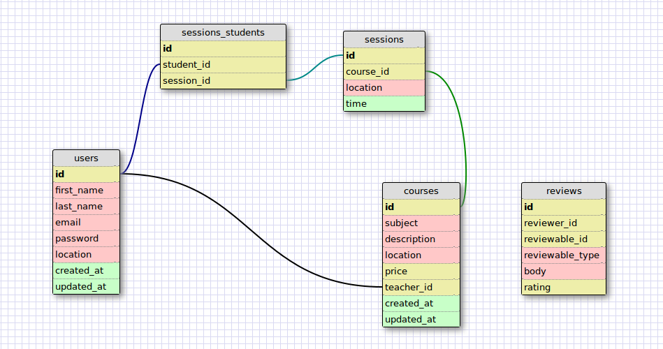

# levelUp

##Project Name

##Names and github handle for people on the team

- Nhan Nguyen ([nhantnon](https://github.com/nhantnon))
- Cory Mathis ([coryrmathis](https://github.com/coryrmathis))
- Matthew Dimesky([dimesky](https://github.com/dimesky))
- Tae Jun Yun ([yuntsj](https://github.com/yuntsj))

##Description of project

###Model Schema

##How to install the code locally

##How to use the app

##License
